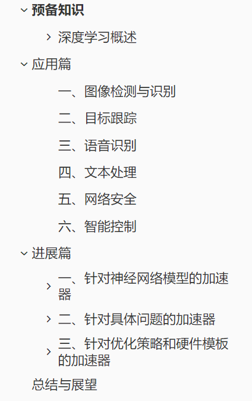
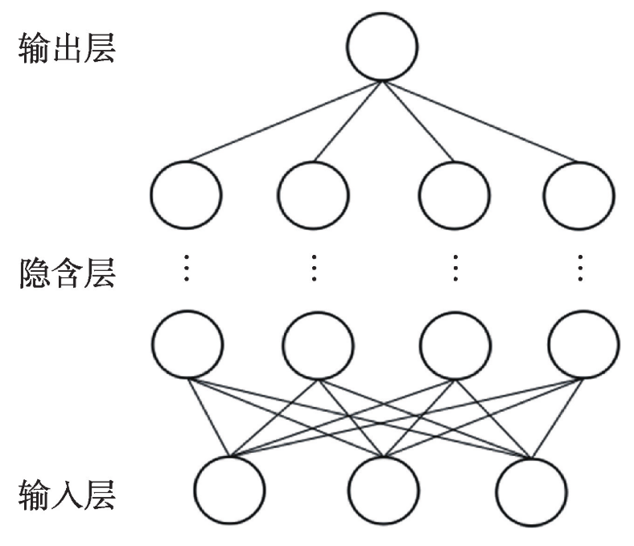
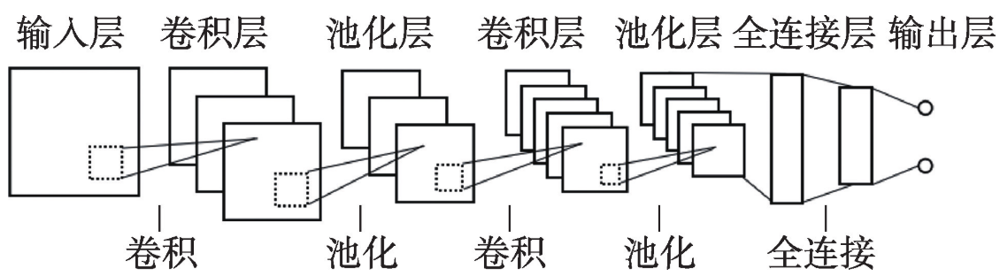
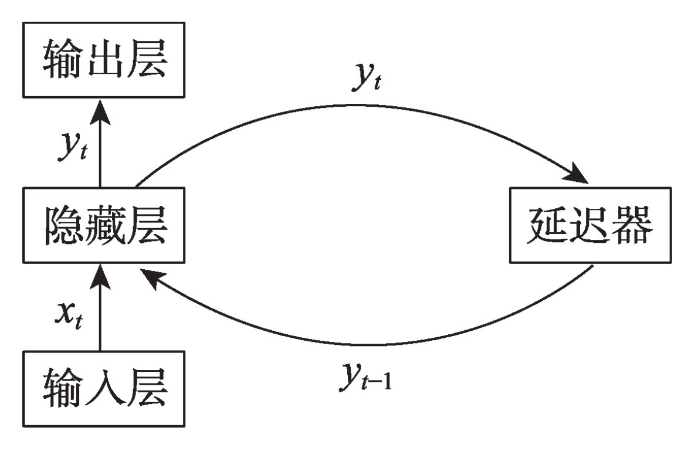
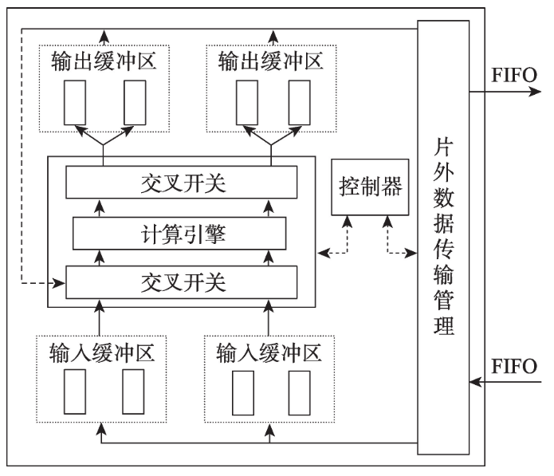
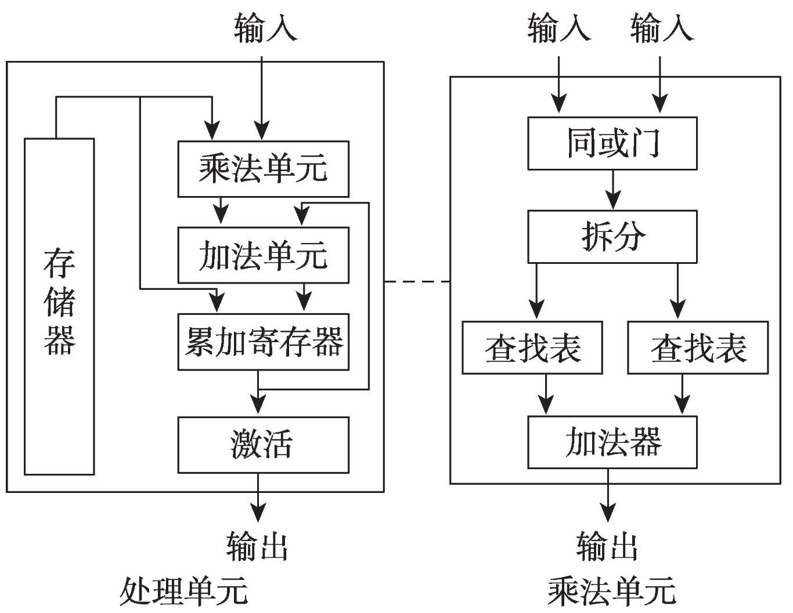
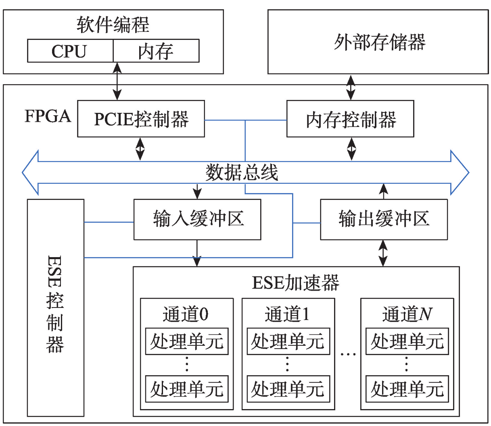
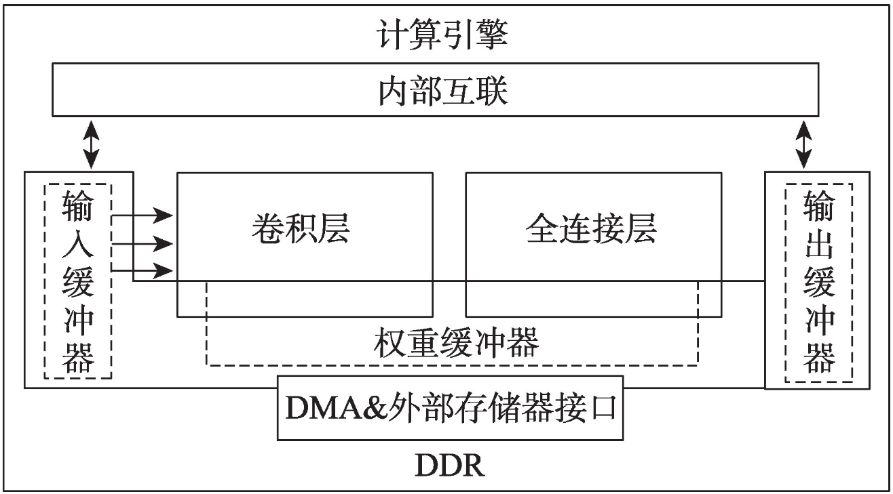
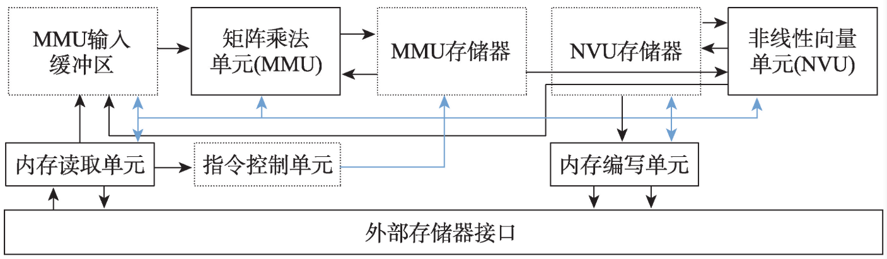

# 预备知识

人工智能是研究用于模拟和扩展人类行为的一门新型技术学科。对于人工智能，特别是基于深度学习的应用来说，很多应用场所都对实时性有着很高的要求。面对这个新时代提出的新要求，FPGA利用其特点，发挥着它重要的作用。

### 深度学习概述

深度学习的实质，是通过构建具有很多隐层的机器学习模型和海量的训练数据，来学习更有用的特征，从而最终提升分类或预测的准确性。

#### 1. 深度神经网络（DNN）

深度神经网络是在单层感知机的基础上通过增加隐含层的数量及相应的节点数而形成的。主要用于图像识别和语音识别领域，在图像识别时可以忽略图像的空间几何关系，将其变为一维数据进行处理，因此相比于单层感知机有着更优秀的性能表现。

随着神经网络层数的不断加深，参数数量的膨胀导致过拟合的现象愈发严重，并且优化函数越来越容易陷入局部最优解。为了克服这一问题，卷积神经网络应运而生。

#### 2. 卷积神经网络（CNN）

卷积神经网络模仿生物视觉系统结构，其隐含层包括卷积层、池化层和全连接层三类常见构筑。卷积层和池化层通过运算提取出数据的特征图，在全连接层将特征图映射成特征向量，从而把数据中的特征保存下来以达到识别分类的目的。

卷积神经网络的适应性更强，正逐渐成为图像识别和自然语言处理等领域的主流网络。

#### 3. 循环神经网络（RNN）

循环神经网络是一类以序列数据为输入，在序列的演进方向进行递归且所有节点按链式连接的递归神经网络。

循环神经网络具有记忆性、参数共享并且图灵完备，因此更擅长学习序列的非线性特征，常被用于自然语言处理和时间序列预报等领域。

# 应用篇

### 一、图像检测与识别

为了降低产品价格和功耗、提高产品稳定性和速度，大多数企业会选择使用FPGA作为图像识别算法的硬件载体。近年来，关于FPGA上面部署图像识别的应用越来越多，如人脸识别、人手姿态识别、字符识别、 车牌识别、交通标志识别、自然场景识别等等。

在以上的场景中，目标检测与识别任务起到了重要的作用。计算机视觉中的图像目标检测是重要研究方向。

### 二、目标跟踪

目标跟踪最近几年发展迅速，不少研究者在研究如何在FPGA上实现目标跟踪系统，从而推动产业应用。目标跟踪系统在军事侦察、安防监控等诸多方面均有广泛的应用前景。

### 三、语音识别

目前，深度神经网络除了在图像和视频领域应用越来越广泛以外，基于FPGA的语音识别系统也成为研究热点。由于其庞大的市场需求，语音识别发展速度异常迅猛。在智能语音识别产品中，为保证一定的灵活性和移动性，往往在FPGA上部署语音识别模型，以满足智能与生产落地的需求。

### 四、文本处理

在文本语言处理方面，FPGA与深度学习结合的应用成为一大热点，其将被广泛地应用于各种机器翻译，用户情感分析等产品中去。同时，研究表明人们对于文本处理速度有着一定的要求，因此大量的研究将以简化语义模型以及提升FPGA计算速度为目的进行展开。

### 五、网络安全

网络安全与入侵检测也是FPGA与深度神经网络结合的一个重要应用，主要是对于网络系统中收集的信息进行分析，然后通过某种模型判断是否存在异常的行为。基于FPGA的网络安全与入侵检测系统就是为了对于网络进行实时监控，并在网络系统异常时或者对外来攻击进行及时的反应，以保证网络系统的安全性。

### 六、智能控制

除了以上几种典型的应用，基于 FPGA 的深度神经网络系统还在智能控制领域得到了广泛的应用。如基于人工神经网络的步进电机低速阻尼控制器等。将基于FPGA的深度神经网络用于实际控制，打破了传统逻辑控制模式，实现了控制系统的自动化和智能化。

# 进展篇

### 一、针对神经网络模型的加速器

#### 1. 卷积神经网络的FPGA加速器

FPGA加速卷积神经网络的关键在于提高计算能力和数据传输速度，通常采用提高卷积神经网络中并行计算能力的方法来提升计算效率以及利用减少数据量、减少访存次数等方式来解决数据传输开销大的问题。

1. 在输入和输出部分分别采用两个缓冲区并使用“乒乓”的数据传输机制，得以使用计算时间来掩盖数据传输时间，并且计算引擎内部是底层乘法器联合多层加法器的“树形”结构，多个计算引擎并行进行不同卷积核的卷积操作，由此减少了程序执行时间。

   

2. 使用大量寄存器代替BRAM的方法来降低结构对外部接口的带宽需求。

3. 基于移位寄存器的串矩转换结 构和基于脉动阵列的卷积层和池化层运算单元，这种架构可以搭建任意规模的CNN模型，并且提高了频率和计算吞吐量，减小了输入、输出带宽需求。

4. 将FPGA的片上资源划分成多个小处理器来提高计算能力。

5. 使用二值神经网络来降低数据精度提高数据传输速度，进而提高卷积神经网络的计算效率。

   

6. 动态精度数据量化，使神经网络不同层对应的定点数的整数和小数位数不同，进而实现了在找到更短的定点数位数的同时保持需要的准确率。

#### 2. 递归神经网络的FPGA加速器

从提高FPGA的计算性能和资源利用的角度出发进行加速设计。

1. LSTM模型：基于FPGA的LSTM-RNNs加速器，缓冲区可以保存状态参数而下一级计算就无需重新加载，从而降低了对带宽的要求。
2. GRU模型：Nurvitadhi等通过将矩阵拆分成多个列块进而进行并行计算， 最终用减少2/3内存空间的代价换取了矩阵向量乘法减少一半的效果，证明了此研究方向的可行性。

### 二、针对具体问题的加速器

设计难度相对较小并且能很好地解决相应的问题，是目前FPGA加速器最广泛的应用形式。

#### 1. 针对语音识别的FPGA加速器

语音识别是指能够让计算机自动地识别语音中所携带信息的技术，具有实时性强和集成度高的特点。

在加速语音识别方面，针对LSTM模型压缩后出现的多核并行负载不均衡的问题，学者设计了专门用来加速LSTM的剪枝算法和相应的ESE（efficient speech recognition engine）新架构。

该结构的核心在于FPGA上的ESE加速器，该加速器通过使用多个由处理单元和激活向量队列单元组成的通道单元来解决多核并行负载不均衡的问题。处理单元均采用双缓冲区结构和“乒乓”数据传输方式以提高执行效率；运行较快的处理单元可以 从激活向量队列单元中获取数据继续工作而无需等待其他处理单元，从而解决了不同处理单元工作负载不平衡所带来的问题。

#### 2. 针对图像识别的FPGA加速器

图像识别是指利用计算机对图像进行处理、分析和理解以识别各种不同模式的目标和对象的技术，是深度学习最早尝试应用的领域。

屈伟根据roofline模型选取最合适的并行展开因子使得在FPGA上具有最高的性能峰值。

这种架构将图像从DDR输入到FPGA片上缓存，并且在片上本地缓存只缓存正在计算的权值，缓存的特征图作为下一卷积层的输入与卷积核再次卷积，直到得到最后输出。

#### 3. 针对自然语言处理的FPGA加速器

自然语言处理（natural language processing，NLP）也是深度学习的一个重要应用领域，目前基于统计的模型已成为NLP的主流，同时人工神经网络在NLP领域也受到了理论界的足够重视。

Khan等提出的基于FPGA的覆盖式处理器NPE（FPGA-based overlay processor for NLP model inference at the edge）可以高效地执行各种自然语言处理模型。

利用各种功能单元和对应的内存缓冲区以及FPGA配置灵活性的特点搭建一个具有类似软件 可编程性的架构以适应自然语言处理极为广泛多样且复杂多变的应用环境。

### 三、针对优化策略和硬件模板的加速器

#### 1. 针对优化策略的加速器

合理的优化可以明显提高加速器的性能以及资源利用率。目前研究较多的优化策略主要包括计算优化和内存优化。

1. 计算优化：包括提高并行计算能力、循环流水技术、循环分块和循环展开等。
2. 内存优化。包括减小数据精度和层间数据复用等。

不论是面向计算还是内存的优化，其目的都在于降低FPGA的计算复杂度，提高数据交换能力以及资源利用率。

#### 2. 针对优化策略的加速器

研究人员使用现成的硬件模板来设计加速器是另一种可行方案，因为这些FPGA硬件模板已经实现了某些编程模型，人们只需针对自己的具体问题再进行模块完善和配置参数即可.

# 总结与展望

随着深度学习的不断发展，加速深度学习的研究近年来备受关注，虽然FPGA凭借其可重构、低能耗等优势在加速深度学习方面取得了一定成绩，但是也存在硬件编程困难以及重构过程时间成本较大等不可忽视的劣势，因此FPGA要达到更加为人们所熟知和更为广泛应用的阶段仍然有很长的路要走。

